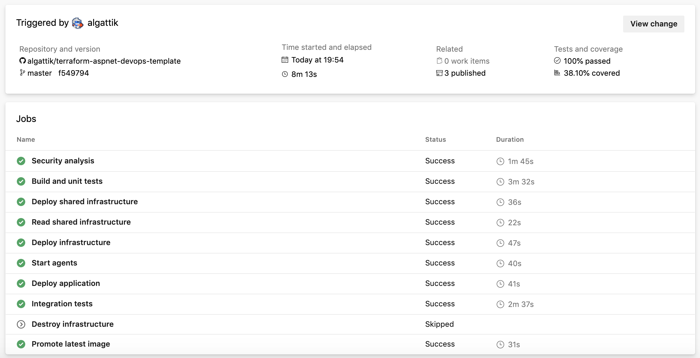

# Terraform ASP.NET Core Kubernetes DevOps template

This sample demonstrates how to build and deploy ASP.NET Core microservice applications using a CI/CD pipeline that includes IaC deployment jobs with Terraform. The pipeline is designed for fully automated end-to-end integration testing with
high deployment speed and high branch concurrency.


*Build that completed in 8 minutes with parallel jobs, building and deploying application and transient cloud infrastructure in 4 minutes, running integration/load tests for 2 minutes, and producing unit test, coverage and integration test reports.*

This sample is used by the Microsoft [Commercial Software Engineering](https://microsoft.github.io/code-with-engineering-playbook/CSE.html) teams to bootstrap agile DevOps projects. It enables entire teams of developers to submit multiple Pull Requests (PRs)
per day, maintaining the integrity of the master branch by ensuring full deployment and integration tests are performed
before code is merged. It has for example been used to build the [K2Bridge](https://github.com/microsoft/K2Bridge) open-source project.

- ASP.NET Core modules and custom code for application observability, including exposing rich metrics to Application Insights or third-party tools.
- Managing the entire application lifecycle including infrastructure deployment, application build and installation, and automated testing with a single multi-job YAML pipeline.
- Building a very fast CI/CD pipeline with parallel jobs and self-hosted agents.
- Effective, declarative integration testing using Taurus/JMeter running on self-hosted agents in the same VNET as your Kubernetes cluster, thus having "line of sight" into the cluster also when no external ingress is provided.

  Sample integration test testing the microservice endpoint summing numbers from 1 to 100, running 1 rps for 20 seconds,
  and verifying the response:

```yaml
  - task: AlexandreGattiker.jmeter-tasks.custom-taurus-runner-task.TaurusRunner@0
    displayName: 'Run Taurus'
    inputs:
      reportName: 'Test Sum Computation Endpoint'
      taurusConfig: |
        execution:
        - scenario:
            requests:
            - url: $(SERVICE_URL)/sample/sumNumbersUpTo?value=100
              assert:
              - contains:
                - 5050
                subject: body
          hold-for: 20s
          throughput: 1
        reporting:
        - module: junit-xml
          filename: taurus-output/TEST-Taurus.xml
```

# Walkthrough

[Walkthrough](docs/walkthrough.md)

# Installation

[Installation](docs/installation.md)
