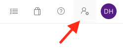

# Installation

The variables referenced in the following guide refer to the [azure-pipelines.yml](../azure-pipelines.yml) file. To edit them, change the value there, e.g.:

  ```yml
  - name: TERRAFORM_SP_CLIENT_ID
    value: XXXXXXXX-XXXX-XXXX-XXXX-XXXXXXXXXXXX
  ```

## Azure Active Directory configuration

1. Create service principals for Terraform & AKS:
    - Info: An Azure service principal is a security identity used by user-created apps, services, and automation tools to access specific Azure resources. Think of it as a 'user identity' (login and password or certificate) with a specific role, and tightly controlled permissions to access your resources. We use these to grant access to Azure DevOps and Terraform to deploy and manage resources within our Azure subscription.
    
    - Navigate to the Azure Portal & open the [Cloud Shell](https://docs.microsoft.com/en-us/azure/cloud-shell/overview). You need to create two service principals (Azure Active Directory App registrations) for Terraform and AKS by entering the following commands:

      ```
      az ad sp create-for-rbac --name "PROJECT_Azure_DevOps_Terraform_SP" --role owner

      az ad sp create-for-rbac --name "PROJECT_AKS_SP" --skip-assignment
      ```

    - Save the outputs of these commands as you'll need these details during the installation. The output comes in the following format:

      ```json
      {
        "appId": "XXXXXXXX-XXXX-XXXX-XXXX-XXXXXXXXXXXX",
        "displayName": "PROJECT_Azure_DevOps_Terraform_SP",
        "name": "http://PROJECT_Azure_DevOps_Terraform_SP",
        "password": "XXXXXXXX-XXXX-XXXX-XXXX-XXXXXXXXXXXX",
        "tenant": "XXXXXXXX-XXXX-XXXX-XXXX-XXXXXXXXXXXX"
      }
      ```

2. Retrieve and save the object_id for each of the Service principals by using the Cloud Shell: 
      
    - Replace XXXXXXXX-XXXX-XXXX-XXXX-XXXXXXXXXXXX with the appID each of the Service Principals

      ```bash
      az ad sp show --id XXXXXXXX-XXXX-XXXX-XXXX-XXXXXXXXXXXX | jq -r .objectId
      ```

3. Replace the values of the following variables in the [azure-pipelines.yml](../azure-pipelines.yml):

    | name | value |
    |--|--|
    | TERRAFORM_SP_CLIENT_ID | The appId of the Terraform Service Principal |
    | AKS_SP_CLIENT_ID | The appId of the AKS Service Principal |
    | AKS_SP_OBJECT_ID| The objectId of the AKS Service Principal - from the previous step |

## Azure configuration

1. Create the resource group for your project in Azure by running the following command:

    ```bash
    az group create --name PROJECT_RG --location westeurope
    ```

1. Grant TERRAFORM_SP_CLIENT_ID *Owner* permission on the RG. To do this, replace the values in assignee and scope parameters accordingly. The scope parameter is the id parameter from your previously created resource group.

    ```bash
    az role assignment create --assignee TERRAFORM_SP_CLIENT_ID --role Owner --scope /subscriptions/YourSubscriptionId/resourceGroups/PROJECT_RG
    ```

1. Create the storage account $(TERRAFORM_STORAGE_ACCOUNT) within the RG. Info: Storage account name must be between 3 and 24 characters in length and use numbers and lower-case letters only.

    ```bash
    az storage account create --name projectstorageaccount --resource-group PROJECT_RG
    ```

1. Create the container "terraformstate" within the storage account

    ```bash
    az storage container create --name terraformstate --account-name projectstorageaccount
    ```

1. Replace the values of the following variables in the [azure-pipelines.yml](../azure-pipelines.yml):

    | name | value |
    |---|---|
    | RESOURCE_GROUP | The name of the resource group |
    | TERRAFORM_STORAGE_ACCOUNT | The name of the storage account |


## Azure DevOps configuration

### 1. Create an ADO agent pool named $(AGENT_POOL_NAME)
- To create an agent pool, go to the Azure DevOps web UI and navigate to your current organization
- On the bottom left, go to "Organization Settings"
- In the left pane, under Pipelines, click on Agent pools
- Click on "Add Pool" at the top right of the window
- Type in the desired name for the agent pool - make note of that name for variable assignment later

### 2. Create an Azure DevOps Variable Group named `terraform-aspnet-devops-template`:
    
- Go to the Azure DevOps UI and in your project, navigate to Pipelines/Library
- Click the "+ Variable Group" button
- Add these variables:

| name | value |
| --- | --- |
| APP_NAME | Pick a short, globally unique name, e.g. "aspnetmplt000010" |
| AGENT_POOL_MANAGEMENT_TOKEN | Create an ADO PAT with Agent Manage permission (See 2.1) |
| AKS_SP_CLIENT_SECRET | Secret for AKS_SP_CLIENT_ID |
| TERRAFORM_SP_CLIENT_SECRET | Secret for TERRAFORM_SP_CLIENT_ID |

### 2.1. Create an ADO Personal Access Token (PAT) with Agent manage permission

- On the top left of the Azure DevOps UI, click on the "User settings" icon and select "Profile".

  

- In the left pane, select "Personal Access Tokens"

- Click "New Token"

- Select the "Agent manage permission"

- Copy the secret to a secure place and then into the Variable Group

### 2.2. Get the secret for the AKS Service Principal

When creating the AKS Service principal, a password was created which is needed here. To retrieve that secret, you can go to the Azure portal and navigate to: `Azure Active Directory/App registrations/<YOUR AKS SP NAME>` and click on **Certificates and secrets** on the left pane.

### 2.3. Get the secret for the Terraform Service principal

When creating the Terraform Service principal, a password was created which is needed here. To retrieve that secret, you can go to the Azure portal and navigate to: `Azure Active Directory/App registrations/<YOUR AKS SP NAME>` and click on **Certificates and secrets** on the left pane.

    
### 3. Install ADO extensions:

| Extension | Url |
|---|---|
| Secure dev tools | https://marketplace.visualstudio.com/acquisition?itemName=securedevelopmentteam.vss-secure-development-tools |
| Terraform | https://marketplace.visualstudio.com/items?itemName=ms-devlabs.custom-terraform-tasks |
| JMeter | https://marketplace.visualstudio.com/items?itemName=AlexandreGattiker.jmeter-tasks |


### 4. Create a new Azure Resource Manager Service Connection $(TERRAFORM_SERVICE_CONNECTION) with access to the $(RESOURCE_GROUP) resource group.
    
- Go to Azure DevOps Project settings
- Select Service Connections (if you want to learn more about this, got to [Service connections in Azure docs](https://docs.microsoft.com/en-us/azure/devops/pipelines/library/service-endpoints?view=azure-devops&tabs=yaml))
- Create a new Service connection
- Pick Azure Resource Manager (which gives access to Azure Resources commands)
- Create a new Azure service connection:
  - Select Service Principal (automatic)
  - Don't select a resource group, as we don't have one yet - this allows the SP to access all Resource Groups
  - Give the Service connection a name - we will need that name for Terraform later (e.g. Terraform_SP)
  - Check the "Grant access permission to all pipelines" box

### 5. Replace the values of the following variables in the [azure-pipelines.yml](../azure-pipelines.yml):

| name | value |
|---|---|
| AGENT_POOL_NAME | The name of the created Agent Pool in step 1 of the Azure DevOps configuration |
| TERRAFORM_SERVICE_CONNECTION | The name of the service connection |
| ACR_NAME | Pick the name of the Azure Container Registry, e.g. yourprojectacr |
| HELM_RELEASE_NAME | Pick a name for the Helm release |
| SUBSCRIPTION_ID | The id of your Azure Subscription. See 5.1. |
| TENANT_ID | Tenant id of your Azure subscription. See 5.2. |

### 5.1. Get Azure Subscription id

Run the following command to get a list of all your subscriptions and pick your subscriptions id:

  ```bash
  az account list --output tab file
  ```

### 5.2. Get Azure Subscription tenant id

Run the following command and replace the sub-id with the subscription id of your subscription:

```bash
az account show -s XXXXXXXX-XXXX-XXXX-XXXX-XXXXXXXXXXXX | jq -r .tenantId
```

### 6. Run the pipeline azure-pipelines.yml on master

- Hint: On the first run some of the jobs might fail with the error message:

  ```##[error]No agents were found in pool $AGENT_POOL_NAME. Configure an agent for the pool and try again.```
  
  which can happen due to a delay in creation of agents in the agent pool. 

- if you don't run on master, make sure to include the variable RUN_FLAG_TERRAFORM to 1 in the Azure DevOps portal before running the pipeline. See the [ci-cd-pipeline.yml](../infrastructure/ci-cd-pipeline.yml) for more information.
