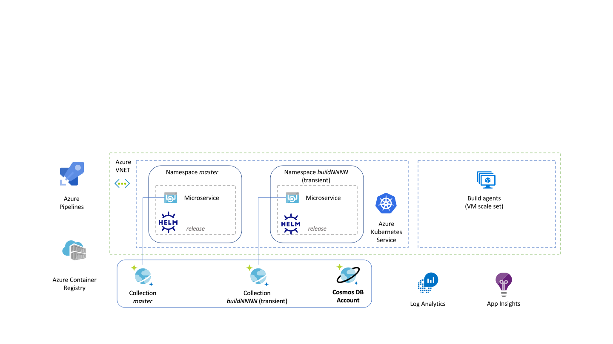
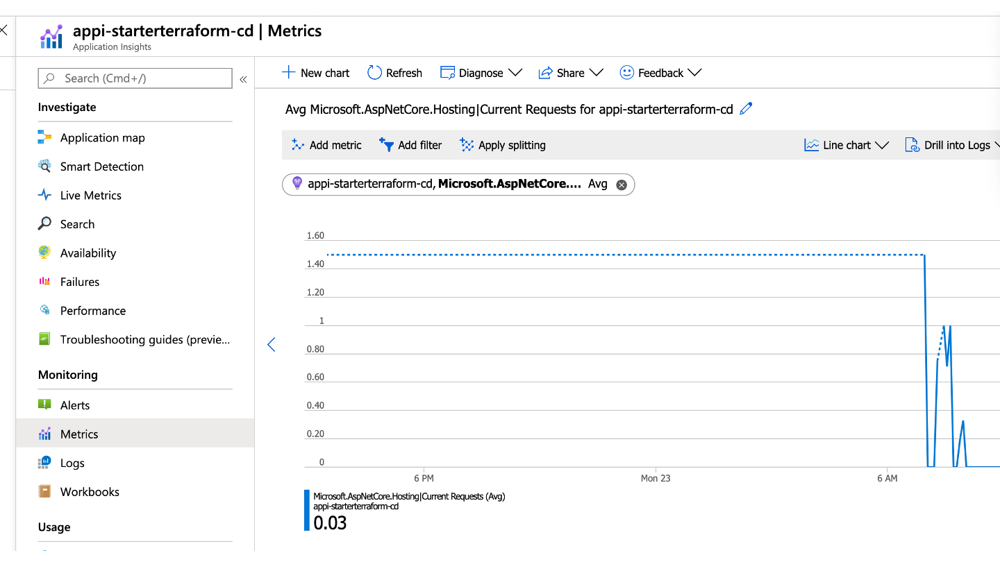
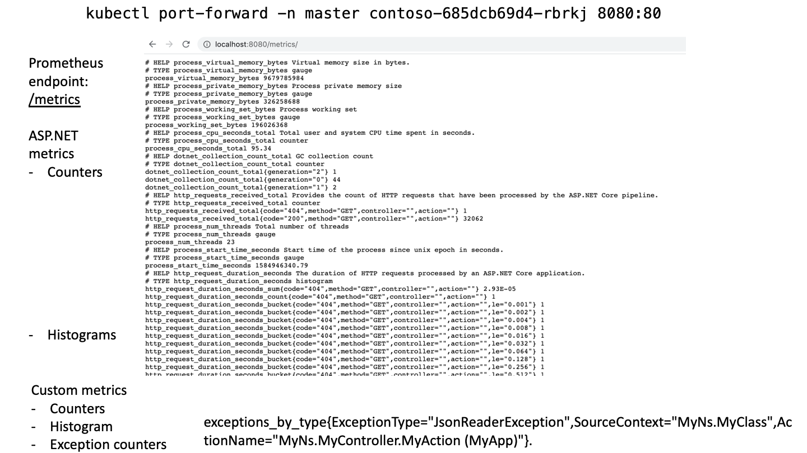

# Walkthrough

## Introduction

This sample demonstrates how to build and deploy ASP.NET Core microservice applications using a CI/CD pipeline that includes IaC deployment jobs with Terraform. The pipeline is designed for fully automated end-to-end integration testing with
high deployment speed and high branch concurrency.

The solution aims to maximize developer productivity. A build pipeline (Azure Pipelines) deploys shared infrastructure, retained between builds, as well as transient infrastructure on which the application is deployed for integration testing. At the end of the build the application and underlying transient infrastructure are automatically destroyed.

The sample application shows how a microservice application can integrate with the Azure ecosystem to provide observability with Azure Monitor (Application Insights and Log Analytics).

The CI/CD pipeline is heavily optimized for speed and full automation, with the deployment of managed build agents to quickly build docker images and run multiple parallel jobs. The sample solution can be adapted to almost any stack by switching the Azure components and implementing application logic as required.

## Overview

The architecture contains an Virtual Network with a subnet containing Azure DevOps self-hosted build agents managed as a
Virtual Machine Scale Set, and a subnet containing an Azure Kubernetes Service cluster. A Cosmos DB Database serves as backend
for the application.



An Azure DevOps pipeline creates
the entire infrastructure, builds the application Docker container on the build agents, and pushes the image to Azure Container
Registry. The pipeline then deploys an "area" for the build including a separate Cosmos DB collection and Kubernetes namespace,
runs integration tests within the area, and destroys the area infrastructure. This allows multiple pipeline runs to execute
concurrently, reusing core infrastructure while largely avoiding testability issues with shared application-level resources.

## CI/CD pipeline

The [build pipeline](../infrastructure/ci-cd-pipeline.yml) is highly optimized for speed, and achieves high task parallelism by breaking down the process into 10 jobs
that can partly run concurrently.


- **Deploy shared infrastructure**: Uses Terraform to deploy core infrastructure shared between builds. This job is skipped by
  default on PR builds, to maximize build speed. The sample solution deploys:
  - [Azure Virtual Network](../infrastructure/terraform-shared/vnet/main.tf):
    for hosting VMs and Kubernetes
  - [Virtual Machine Scale Set with self-hosted build agents](../infrastructure/terraform-shared/devops-agent/main.tf):
    for running subsequent build jobs. Multiple Azure DevOps
    build agents are deployed per VM, to provide high concurrency at low cost.
  - [Azure Kubernetes Service](../infrastructure/terraform-shared/aks/main.tf):
    for hosting the microservice application
  - [Azure Container Registry](../infrastructure/terraform-shared/acr/main.tf):
    for storing the built application Docker container
  - [Application Insights](../infrastructure/terraform-shared/app-insights/main.tf):
    for application monitoring and metrics
  - [Azure Log Analytics](../infrastructure/terraform-shared/aks/main.tf):
    for Kubernetes and application logs
  - Cosmos DB Database:
    as an application backend
- **Start agents**: Scales up the Virtual Machine Scale Set to ensure agents are available. This enables users to set up
  jobs that scale down the scale set (even to zero) to save costs overnight, while making those VMs available for the next
  build that requires them, without additional work. This job runs concurrently with other jobs, so has no impact if the VMs are already running.
- **Read shared infrastructure**: Uses Terraform to populate job variables with the deployed configuration such as names
  and credentials to resources.
- **Build and unit tests**: Runs the application dockerized build and unit testing. Using a self-hosted agent allows reusing cached Docker layers for significant speed gain.
- **Deploy infrastructure**: Uses Terraform to deploy infrastructure specific to each individual build. This step is run in parallel with the application build, to maximize pipeline speed. The sample solution deploys:
  - Kubernetes namespace: as a container for the application Helm release
  - Cosmos DB Collection: as an application backend
- **Deploy application**: Uses Terraform to deploy the application container, packaged in a Helm chart.
- **Integration tests**: Uses Taurus and JMeter to run integration tests by hitting the application API endpoint and verifying assertions on the response.
- **Destroy infrastructure**: Uses Terraform to destroy the per-build infrastructure provisioned by the **Deploy infrastructure** step. Destroying the Kubernetes namespace causes the application to also be destroyed, so this steps also destroys the components provisioned by the **Deploy application** job. This job retain the shared infrastructure deployed by
the **Deploy shared infrastructure** job.
- **Security analysis**: Runs static code analysis on the source code. To speed up the end-to-end pipeline, this job is run
concurrently with build & integration testing.
- **Promote latest image**: This step tags images that have passed unit and integration tests as well as security analysis.
You can be customized it for your particular needs, such as triggering a production deployment, and/or pushing the image
to a separate container registry or repository. 

## Multi-layer IaC approach

This image shows the three layers corresponding to three distinct Terraform jobs that each deploy part of the infrastructure.
Separating the deployment into such layers enable:
- high concurrency of builds, without deadlocks on Terraform state (as the *shared infrastructure* is not run on PR builds).
  Multiple "areas" deployed for each build can co-exist at any point in time, and can be automatically deleted after builds,
  or retained e.g. for demos or manual testing.
- high speed of builds, as the *infrastructure* components are deployed while the app is built.


## Sample ASP.NET Core application

The [sample ASP.NET Core application](../Src) is a dummy Web API application exposing a single service. The service accepts a positive
number N and returns the sum of integers from 1 to N. It is implemented recursively, and calls itself with the value N-1 and sums the result with N.


The application demonstrates observability patterns:
- Health and liveness probes using [ASP.NET Core Health Checks Middleware](https://docs.microsoft.com/en-us/aspnet/core/host-and-deploy/health-checks?view=aspnetcore-3.1)
- Kubernetes monitoring using [Azure Monitor for containers](https://docs.microsoft.com/en-us/azure/azure-monitor/insights/container-insights-overview)
- Distributed tracing with header propagation across HTTP calls using [ASP.NET Core IHttpClientFactory](https://docs.microsoft.com/en-us/dotnet/architecture/microservices/implement-resilient-applications/use-httpclientfactory-to-implement-resilient-http-requests)
- Application telemetry using [Application Insights for ASP.NET Core applications](https://docs.microsoft.com/en-us/azure/azure-monitor/app/asp-net-core)
- Structured application log capture using Serilog:
  - [Serilog sink for Azure Application Insights](https://github.com/serilog/serilog-sinks-applicationinsights)
  - Logging to console and using [Azure Monitor for containers](https://docs.microsoft.com/en-us/azure/azure-monitor/insights/container-insights-overview) to forward logs to Azure Log Analytics

- Application metrics collection:

  - Standard host and platform metrics using [Application Insights for ASP.NET Core applications](https://docs.microsoft.com/en-us/azure/azure-monitor/app/asp-net-core)
  - [Custom application metrics]((../Src/Contoso/Observability/MetricsService.cs) and gauges, e.g. tracking timing of external calls
  - Exception counters, [using Serilog](../charts/contoso/templates/configmap.yaml)

  Metrics are exposed in two ways:

  - [Pushing metrics](../Src/Contoso/Observability/TelemetryInitializer.cs) to Application Insights
  - [Exposing metrics](../Src/Contoso/Observability/PrometheusSerilogSink.cs) through a Prometheus-compatible endpoint. Prometheus is a popular open-source monitoring package, and
  many vendor monitoring package support metrics collection from Prometheus endpoint as a de facto standard.

## Screenshots

Live metrics generated in Application Insights during integration (load) testing.


Application metrics query interface in Application Insights.




Prometheus metrics exposed by the application out of the box.



Code to [generate custom metrics](../Src/Contoso/Observability/MetricsService.cs), exposed to the Prometheus endpoint and Application Insights.


Structured logs generated by the C# code. Logs contain both the formatted string and the values of the individual
placeholders, allowing [rich analytical queries](https://docs.microsoft.com/en-us/azure/azure-monitor/log-query/log-query-overview). This log line was generated by this [line of code](../Src/Contoso/Services/SampleService.cs):

```c#
            this.logger.LogInformation("Sum of numbers from 0 to {value} was {result}, computed in {duration}s", value, result, duration);
```


